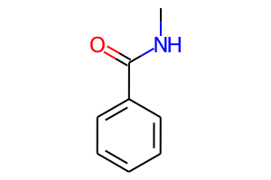
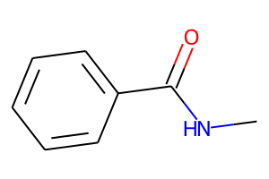

# Nim RDKit Bindings

Rudimentary binding of the C++ cheminformatics toolkit [RDKit](http://rdkit.org/) for the [Nim](https://nim-lang.org) programming language.  All functionality in this project is wrapped from the totally awesome RDKit directly or a re-write of available Python code (e.g. the `qed` module).

[Example](examples/ex01_mol_from_smiles.nim) for creating the mol object from the Smiles "c1ccccc1C(=O)NC" (methyl benzamide) and calculating some properties:

    $ nim build examples/ex01_mol_from_smiles.nim 
    $ LD_LIBRARY_PATH=$RDKIT_CONDA/lib ./bin/ex01_mol_from_smiles
    
    Output (shortened):
        Mol Ok:            true
        Num Atoms:         10
        Mol weight:        135.166
        Rot. Bonds:        1
        Num HetAtoms:      2
        Canonical Smiles:  CNC(=O)c1ccccc1
        TPSA:              29.1
        SSSR:              1

Pre-requisites:
* Installations of RDKit (e.g. via `conda`) and Nim

The path to your conda installation of the RDKit has to be set by an environment variable, e.g. in `~/.profile`:

    export RDKIT_CONDA=/home/pahl/anaconda3/envs/chem

Obviously, this project will change quickly. In the current state it is mainly for showing off my first success.  
The following functionality from RDKit has been wrapped so far:

* Parsing of molecules to / from Smiles and Smarts: `molFromSmiles (smilesToMol), molFromSmarts; toSmiles`
* Calculation of molecular properties: `numAtoms, molWt, numRings, cLogP, numHBA, numHBD, numRotatableBonds, fractionCSP3, tPSA, findSSSR`
* Substructure search: `hasSubstructMatch, numSubstructMatches, substructMatches`
* Drug-Like properties: The Python [QED](https://github.com/rdkit/rdkit/blob/master/rdkit/Chem/QED.py) module has been re-written in Nim.
* Drawing molecules to SVG format
    - the molecules can be drawn to SVG strings (`mol.toSVG()`), using either the CoordGen method (default) or the original RDKit functionality (`mol.toSVG(coordGen = RDKit)`).

        

For further usage, until a real documentation becomes available, please have a look at the tests and the examples.

## Installation

Clone the repo, `cd` into it and install with `nimble install`.  
From the repo dir you can also run the tests with `nimble test`.  
The output should look like this:

    $ nimble test
    Executing task test in /home/pahl/dev/nim/rdkit_nim/rdkit.nimble
        [draw.nim]             passed.
        [mol.nim]             passed.
        [qed.nim]             passed.
        [sss.nim]             passed.

        All thests passed.

The package documentation can be generated with `nimble docs`.

## Using the package

To use the package in your own projects, the imports have to be of the form:

    import rdkit / [molecule, descriptors]

### Running the Compiled Programs

When running the compiled programs, remember to prepend the call to the binary with the `LD_LIBRARY_PATH`, e.g.:

    $ LD_LIBRARY_PATH=$RDKIT_CONDA/lib my_program

Permanently modifying `LD_LIBRARY_PATH` (e.g. in `~/.profile`) or adding the path in `/etc/ld.so.conf.d/` has messed up my system and lead to errors in other programs, this is therefore not recommended. If someone has an idea how to do this more elegantly, please let me know.
